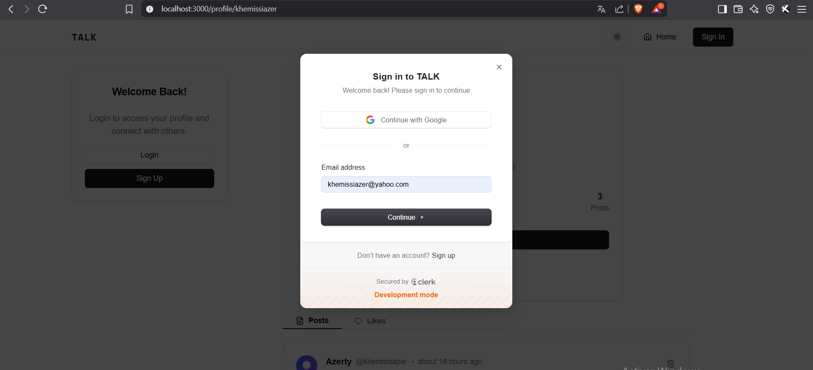
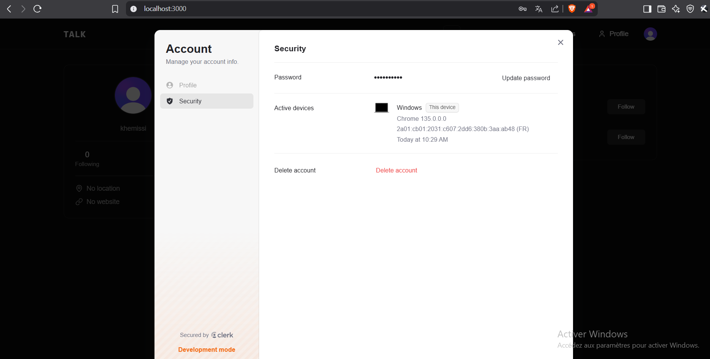

🌟 My Social Network Web Application 🌟

📌 Project Overview
Welcome to TALK, my personal social networking platform, built with modern web technologies. This app is designed with a focus on speed and security. Users can interact by posting content, following each other, and engaging with a vibrant online community.

🚀 Tech Stack
. Next.js App Router: Framework for building a fast, scalable web application with server-side rendering and seamless routing.

. Postgres: Reliable relational database used to store all critical data such as user information, posts, and interactions.

. Prisma: ORM tool simplifying database queries and schema management, making backend development smoother and more efficient.

. Clerk: Handles secure authentication and user management, ensuring easy sign-up and login processes.

. TypeScript: A strongly typed language that enhances code quality and maintainability, reducing errors.

. Tailwind CSS: A utility-first CSS framework that allows rapid, responsive, and consistent design for the frontend.

. Shadcn: A custom library for sleek and modern UI components to enhance the overall user experience.

. UploadThing: A powerful file management solution to handle file uploads seamlessly within the platform.

. Neon: A managed PostgreSQL hosting service for secure and scalable database solutions.

📸 Screenshots
Below are some screenshots showcasing the main features of the application:

### Sign Up / Login :

### Home Page :

### Notifications :

### Profile :

### Edit Profile :

### Edit Account :

